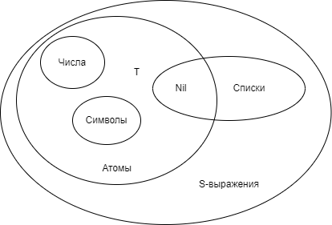

# bmstu_falp
Functional and logical programming 2021/2022 course

# **Важная теоретическая информация по курсу**

> "Работа компьютера - пошаговое изменение состояния вычисления(памяти). Наличие оператора присваивания явяется подтверждением того, что язык императивный." Любое s-выражение по умолчанию воспринимается как программа.
> Лисп написан на лиспе. Лисп использует указатели, а не ссылки. Лисп - расширяемый язык. Всегда возвращается последнее вычисленное значение.
 
 Lisp опирается на лямбда-исчисления Черча. Lisp предложил символьную обработку данных, а не числовую, основываясь на том, что программа - это набор символов(текст). Все можно представить в виде функции или композиции функций (принцип конструирования программ). 
 
 Нет разделения на код и данные. Lisp - интерпретатор. В Lisp нет переменных. "Нет типизации - не надо ничего описывать." Доступ через указатели. Понятие типа связано с объем выделяемой памяти. Lisp сам распределяет память. 2 варианта представления в памяти: блок памяти с 5 указателями или бинарный узел.
 
 Вся информация (код и данные) в Lisp представляется в виде **S-выражений**  = <атом>|<точечная пара>. 
 
 **Базис** Lisp (минимальный набор конструкций язка и структур данных, позволяющий решить любую задачу) образуют: 
* Атом - (элементарная конструкция языка) может обозначать абсолютно любой объект. Может быть представлен как:
  + Символ (идентификаторы) - набор литер, начинающихся с буквы;
  + Специальный символ -  T, Nil (логические константы);
  + Самоопределимый атом - натуральные, дробные, вещественные числа, строки.
* Структура - 
  + Точечная пара = (<атом>.<атом>)|(<атом>.<точечная пара>)|(<точечная пара>.<атом>)|(<точечная пара>.>точечная пара>);
  + Список = <пустой список>|<непустой список>, где <пустой список> = ()|Nil, <непустой список> = <первый элемент>.<хвост>, <первый элемент> = <S-выражение>, <хвост> = <список>.
* Базовые функции;
* Базовые функционалы.

Программы, написанные на Lisp, представляются в виде списков! Это дает возможность генерировать т.н. Lisp-код, что дает разработчику возможность создавать программы, которые пишут программы. Чтобы Lisp не счёл список за вызов функции, его нужно цитировать. В противном случае список будет рассмотрен как код.



Атом в памяти представляется 5 указателями:
* Name;
* Value;
* Function;
* Properties;
* Package.

Классификация функций:
* Чистые (так, как принято в математике, вычисляются *все* аргументы);
* Рекурсивные (организовывают повторные вычисления);
* Специальные или формы - переменное кол-во аргументов или они обрабатываются по-разному, могут вычисляться не все. Входят cond, if, and, or, quote, eval, lambda (анонимные функции, базовый способ опр. функций). Важно помнить про порядок вычисления. Не всегда аргумент может вычисляться => его нет в памяти => при попытке доступа возникнет ошибка;
* Псевдофункции - создают эффекты на экране и тд;
* Функции с вариантами значений;
* Функционалы - в качестве аргументов принимают функции или возвращают функцию (позволяют создавать синтаксически управляемые программы). К ним относятся базовые функции apply, funcall;
* Базисные функции - car, cdr, cons, atom, and, or;
* Функции частичного характера - некорректно обрабатывает некоторые типы аргмуентов.

Классификация базисных функций:
* Селекторы - car, cdr;
* Функции-конструкторы:
  + cons - создает списковую ячейку и расставляет указатели, передается 2 S-выражения;
  + list - (не базисная форма) создает столько списковых ячеек, сколько аргументов, менее эффективная;
* Предикаты:
  + null - пустая ли структура;
  + listp - список или нет;
  + consp - представлена ли структура в виде списковых ячеек;
  + eq - сравнивает указатели на символьные атомы, не сравнивает числа;
  + eql - сравнивает атомы и числа одного типа (= применима только к числам, любого типа), не сравнивает списки, часто исп. в других функциях;
  + equal - eql + списки, но не сравнивает числа разных типов (2 и 2.0);
  + equalp - сравнивает всё.

Функции, реализующие работу со списком:
* Разрушающие структуру - не меняют исходный список, только формируют результа;
* Не разрушающие структуру - меняют состояние списка.

Рекурсивные функции:
* Простая - вызов 1 раз в теле;
* I порядка - несколько раз;
* Взаимная - вызывают друг друга;
* Дополнительная.

В связи с этим есть дубли функций: одна разрущает, другая нет.

**Append**(не разр.): функция объединения списков, работает с копией всех аргументов, кроме последнего. Cdr-указателями они сцепляются. Засчет этого сохраняется возможность работы со всеми списками-аргументами и списком-результатом. Засчет экономии могут возникнуть опасности, т.к. можно работать с дублями и все поменяется.
Дубль append: ncone (префикс n - не создает дубли) просто переставляет указатели.

Все стандартные функции работают по первому уровню вложенности.

Функции в Lisp *всегда* имеют результат. Аргументы и результат - S-выражения.

**Способы определения функций**: лямбда-выражение = (lambda λ-список формы). Вызов: (λ-выражение последовательность форм).

Использование функций с именем: defun. Связывает символьный атом (имя функции) с лямбда-определением. При повторных вычислениях эффективнее использовать лямбда-поределения, т.к. не дергается указатель.

>Задать значение аргументу (присвоить) ~ передать формальный параметр на место фактического.

Функция **let** - аналог лямбда-определения, только связывание формальных параметров с фактическими вынесено в начало.

(let ((x1 p1) (x2 p2) ...) форма) = ((lambda (x1 x2 ...) форма) p1 p2 ...).

Атомы: локальные и глобальные. Можно закрепить значение символьного атома: setf (не вычисляет 1 аргумент) / setq (вычисляет аргумент и устанавливает указатель value). Способ организации глобального атома.

Ассоциативные таблицы: список точечных пар <ключ.значение> (простой вариант) (assoc - вернуть ключ по значению, rassoc - вернуть значение по ключу).

Организация повторных вычислений: функционалы или рекурсия.

Функционалы: применяющие (apply, funcall) и отображающие. Функциональная блокировка: фиксация текущих значений глобальных переменных (окружение состояния памяти).
Отображающие: организация повторных вычислений. (mapcar #'fun lst), (maplist #'fun lst). Дубли mapcan и mapcon, обхединяют результат с помощью ncone, структуроразрушающие. Функция применяется к каждому элементу списка. На выходе список.

(maplist #’fun lst1 lst2 lstk). Mapcar не контролирует длину списков. Прекращает работу, когда заканчивается кратчайший список. Fun должна быть k-аргументной.

(reduce #'fun lst) - применяет функцию каскадно, т.е. применение функции к аргументам, к результату и т.д.

**Список->множество:**

(defun consist-of (lst)
	(if (member (car lst) (cdr lst))1 0))

(defun all-last-element (lst)
	(if (eql (consist-of lst) 0)(list (car lst))()))

(defun collection-to-set (lst)
	(mapcon #'al-last-element lst))

(collection-to-set '(i t i g t k s i f k)) ;; (g t s i f k)

> Рекурсия = ссылка на описываемый объект при определении этого объекта.

Аспекты, о которых нужно думать при написании рекурсивных функций: как выйти из рекурсии? как войти? как запустить 1-ый раз?

Хвостовая рекурсия - рекурсия, при завершении которой результат УЖЕ сформирован, не отстается отложенных вычислений. 

Общий вид хвостовой рекурсии:

```
(defun fun (x)
	(cond ((end-test) end-value)
	       (t (fun changed-x))))```
	      

